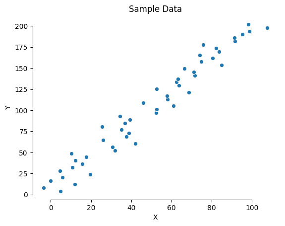

# Linear Regression

Linear regression is a linear approach to modelling the relationship between a dependent variable and one or more independent variables. Linear regression assumes a linear relationship between the input variables () and the single output variable (). When there is a single input variable (), the method is referred to as **Simple Linear Regression**. When there are multiple input variables, this method is referred as **Multiple Linear Regression**

## Model Representation

Linear regression is a simple equation that takes **only** numeric values.

The linear equation


## Pros vs Cons

| Pros | Cons |
|:-----|:-----|
| Simple | Can only handle numeric values |
| | Input data needs a linear relationship | 

## Simple Linear Regression Python & Sklearn

importing libraries


```python
import numpy as np
import seaborn as sns
import matplotlib.pyplot as plt
from sklearn.linear_model import LinearRegression
```

Let's create some sample data


```python
_ = np.linspace(1, 100, 50) 
x = _ + np.random.normal(0, 7, 50)
y = _*2 + 2

sns.scatterplot(x, y)
plt.title('Sample Data')
plt.xlabel('X')
plt.ylabel('Y')
sns.despine(trim=True)
plt.show()
```





Simple linear regression equation


Creating and fitting a model


```python
linear_model = LinearRegression()
predictor = linear_model.fit(x.reshape(-1,1), y.reshape(-1,1))
slope = predictor.coef_[0][0]
intercept = predictor.intercept_[0]
print('β1: {0} \nβ0: {1}\n'.format(slope, intercept))
```

    β1: 1.8895269148719305 
    β0: 9.492638158328134
    


```python
sns.scatterplot(x, y)
plt.title('Model fit')
plt.xlabel('X')
plt.ylabel('Y')
plt.plot(np.arange(1,100,1), np.arange(1,100,1)*slope + intercept, 'r-')
sns.despine(trim=True)
plt.show()
```


```python
sample = 110

prediction = predictor.predict(np.array(sample).reshape(-1,1))

print('Actual value:', sample*2 + 2)
print('Expected value:', slope*sample + intercept)
print('Predicted value:', prediction[0][0])
```

    Actual value: 222
    Expected value: 217.3405987942405
    Predicted value: 217.3405987942405


```python
sns.scatterplot(x, y)
plt.scatter(sample, prediction, c='r')
plt.plot(np.arange(1,110,1), np.arange(1,110,1)*slope + intercept, 'r-')
plt.title('Prediction')
plt.xlabel('X')
plt.ylabel('Y')
sns.despine(trim=True)
plt.show()
```


## References & More Information

[Master Machine Learning Algorithms](https://machinelearningmastery.com/) (Chapter 10 - Linear Regression)