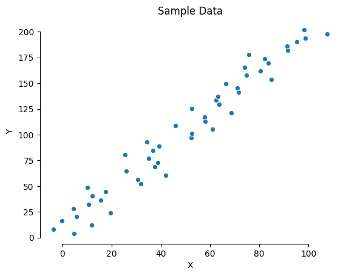
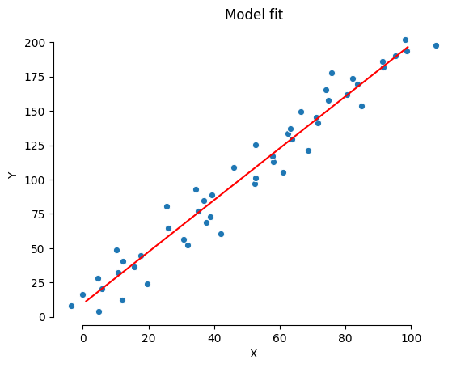
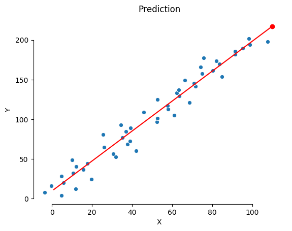
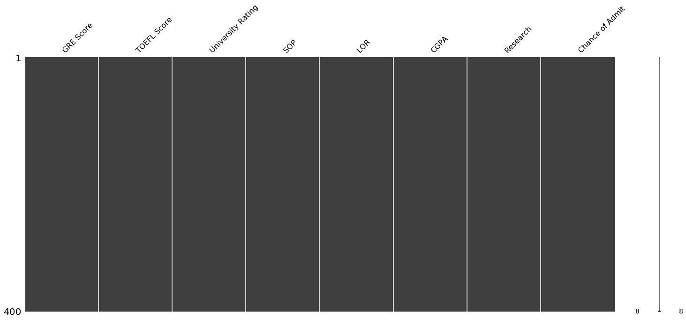
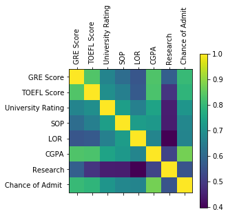
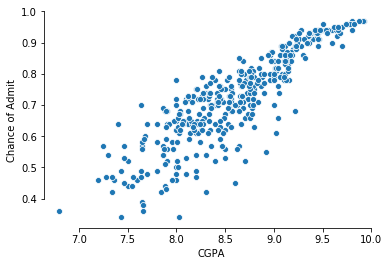
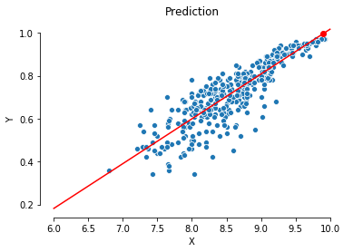

# Linear Regression

Linear regression is a linear approach to modelling the relationship between a dependent variable and one or more independent variables. Linear regression assumes a linear relationship between the input variables () and the single output variable (). When there is a single input variable (), the method is referred to as **Simple Linear Regression**. When there are multiple input variables, this method is referred as **Multiple Linear Regression**

## Model Representation

Linear regression is a simple equation that takes **only** numeric values as input.

<h3> Simple Linear Regression </h3>

The linear equation for a simple linear regression:


<h3> Multiple Linear Regression </h3>

When dealing with multiple independent variables we need to use different methods to fit the model.

The calculation of B1 can be re-written as:


* *corr(x, y) is the correlation between x and y (Pearson's correlation coefficient)*
* *stdev() is the standar deviation of the variable* 

The linear equation for multiple linear regression:


Where **n** is the number of attributes.

Matrix representation (faster for computations):


*(Example) Multiple linear regression for 2 independent variables (attributes):*


## Training (fitting) a linear model

<h3> Simple Linear Model </h3>

With a simple linear regression (a single input) we can use statistics to estimate the coefficients.


<h3> Multiple Linear Regression </h3>

<h4>Ordinary Least Squares</h4>

<h3> Multivariate Linear Regression </h3>

There are also regression models with two or more response variables. These models are usually called Multivariate Regression Models.

## Pros vs Cons

| Pros | Cons |
|:-----|:-----|
| Simple | Can only handle numeric values |
| Interpretable | Input data needs a linear relationship | 

## Data preparation

 - Linear Asumption
 - Remove Noise
 - Remove Collinearity
 - Gaussian Distributions
 - Rescale Inputs

## Considerations

* In higher dimensions when we have more than one input, the line is called a plane or a hyper-plane.
* A  value of 0 removes the influence of that attribute.

## Simple Linear Regression Python & Sklearn

Importing libraries


```python
import numpy as np
import seaborn as sns
import matplotlib.pyplot as plt
from sklearn.linear_model import LinearRegression
```

Let's create some sample data


```python
_ = np.linspace(1, 100, 50)
x = _ + np.random.normal(0, 7, 50)
y = _*2 + 2

sns.scatterplot(x, y)
plt.title('Sample Data')
plt.xlabel('X')
plt.ylabel('Y')
sns.despine(trim=True)
plt.show()
```





Creating and fitting a model


```python
linear_model = LinearRegression()
predictor = linear_model.fit(x.reshape(-1,1), y.reshape(-1,1))
slope = predictor.coef_[0][0]
intercept = predictor.intercept_[0]
print('β1: {0} \nβ0: {1}\n'.format(slope, intercept))
```

    β1: 1.8895269148719305 
    β0: 9.492638158328134
    


Making predictions

```python
sns.scatterplot(x, y)
plt.title('Model fit')
plt.xlabel('X')
plt.ylabel('Y')
plt.plot(np.arange(1,100,1), np.arange(1,100,1)*slope + intercept, 'r-')
sns.despine(trim=True)
plt.show()
```

With the slope **β1** and the intercept **β0** we can plot how well the model fit the data




```python
sample = 110

prediction = predictor.predict(np.array(sample).reshape(-1,1))

print('Actual value:', sample*2 + 2)
print('Expected value:', slope*sample + intercept)
print('Predicted value:', prediction[0][0])
```

    Actual value: 222
    Expected value: 217.3405987942405
    Predicted value: 217.3405987942405


```python
sns.scatterplot(x, y)
plt.scatter(sample, prediction, c='r')
plt.plot(np.arange(1,110,1), np.arange(1,110,1)*slope + intercept, 'r-')
plt.title('Prediction')
plt.xlabel('X')
plt.ylabel('Y')
sns.despine(trim=True)
plt.show()
```





## Case of Study

This time we're going to use [Graduate Admissions Data Set](https://www.kaggle.com/mohansacharya/graduate-admissions/home) to predict the chance of admit.

### Data Set Information

This dataset is created for prediction of Graduate Admissions from an Indian perspective.

The dataset contains several parameters which are considered important during the application for Masters Programs. 

The parameters included are:

|||
|-|-|
| GRE Scores | out of 340 |
| TOEFL Scores | out of 120 | 
| University Rating | out of 5 | 
| Statement of Purpose and Letter of Recommendation Strength | out of 5 | 
| Undergraduate GPA | out of 10 | 
| Research Experience | either 0 or 1 | 
| Chance of Admit | ranging from 0 to 1 | 

### Simple Linear Regression Python


```python
import numpy as np
import pandas as pd
import seaborn as sns
import missingno as msn
import matplotlib.pyplot as plt
from sklearn.linear_model import LinearRegression
```


```python
dataset = pd.read_csv('Admission_Predict.csv')
```


```python
dataset.head()
```


<div>
<style scoped>
    .dataframe tbody tr th:only-of-type {
        vertical-align: middle;
    }

    .dataframe tbody tr th {
        vertical-align: top;
    }

    .dataframe thead th {
        text-align: right;
    }
</style>
<table border="1" class="dataframe">
  <thead>
    <tr style="text-align: right;">
      <th></th>
      <th>Serial No.</th>
      <th>GRE Score</th>
      <th>TOEFL Score</th>
      <th>University Rating</th>
      <th>SOP</th>
      <th>LOR</th>
      <th>CGPA</th>
      <th>Research</th>
      <th>Chance of Admit</th>
    </tr>
  </thead>
  <tbody>
    <tr>
      <th>0</th>
      <td>1</td>
      <td>337</td>
      <td>118</td>
      <td>4</td>
      <td>4.5</td>
      <td>4.5</td>
      <td>9.65</td>
      <td>1</td>
      <td>0.92</td>
    </tr>
    <tr>
      <th>1</th>
      <td>2</td>
      <td>324</td>
      <td>107</td>
      <td>4</td>
      <td>4.0</td>
      <td>4.5</td>
      <td>8.87</td>
      <td>1</td>
      <td>0.76</td>
    </tr>
    <tr>
      <th>2</th>
      <td>3</td>
      <td>316</td>
      <td>104</td>
      <td>3</td>
      <td>3.0</td>
      <td>3.5</td>
      <td>8.00</td>
      <td>1</td>
      <td>0.72</td>
    </tr>
    <tr>
      <th>3</th>
      <td>4</td>
      <td>322</td>
      <td>110</td>
      <td>3</td>
      <td>3.5</td>
      <td>2.5</td>
      <td>8.67</td>
      <td>1</td>
      <td>0.80</td>
    </tr>
    <tr>
      <th>4</th>
      <td>5</td>
      <td>314</td>
      <td>103</td>
      <td>2</td>
      <td>2.0</td>
      <td>3.0</td>
      <td>8.21</td>
      <td>0</td>
      <td>0.65</td>
    </tr>
  </tbody>
</table>
</div>


Let's get rid of the **Serial No.**, it doesn't have useful information.


```python
dataset = dataset.drop(['Serial No.'], axis=1)
```

Now we're going to check for missing values


```python
msn.matrix(dataset)
plt.show()
```





All bars are complete, this means that all columns have an assigned value. If there is a missing value, it must be a non-numeric character (we know this from the dataset information, it only contains numerical values).


```python
dataset.info()
```

    <class 'pandas.core.frame.DataFrame'>
    RangeIndex: 400 entries, 0 to 399
    Data columns (total 8 columns):
    GRE Score            400 non-null int64
    TOEFL Score          400 non-null int64
    University Rating    400 non-null int64
    SOP                  400 non-null float64
    LOR                  400 non-null float64
    CGPA                 400 non-null float64
    Research             400 non-null int64
    Chance of Admit      400 non-null float64
    dtypes: float64(4), int64(4)
    memory usage: 25.1 KB


We need only one dependent variable for a Simple Linear Regression, for that we are going to keep the variable with the highest correlation to the output variable (Chance of Admit).


```python
plt.matshow(dataset.corr())
plt.xticks(range(len(dataset.columns)), dataset.columns, rotation='vertical')
plt.yticks(range(len(dataset.columns)), dataset.columns)
plt.colorbar()
plt.show()
```





The next step is to check if theres a linear relationship between CGPA and Chance of Admit.

**Note:** *this is a must in Linear Regression problems*


```python
sns.scatterplot(dataset['CGPA'], dataset['Chance of Admit '])
sns.despine(trim=True)
plt.show()
```





Now we need to check for outliers.

> Chance of Admit shoud be between [0, 1]

> CGPA should be between [0, 10]


```python
dataset['CGPA'].describe()
```


    count    400.000000
    mean       8.598925
    std        0.596317
    min        6.800000
    25%        8.170000
    50%        8.610000
    75%        9.062500
    max        9.920000
    Name: CGPA, dtype: float64


```python
dataset['Chance of Admit '].describe()
```


    count    400.000000
    mean       0.724350
    std        0.142609
    min        0.340000
    25%        0.640000
    50%        0.730000
    75%        0.830000
    max        0.970000
    Name: Chance of Admit , dtype: float64


In this dataset we don't have outliers. Now let's train a Linear Regression model to predict the Chance of admit based on CGPA score.


```python
linear_model = LinearRegression()
predictor = linear_model.fit(dataset['CGPA'].values.reshape(-1,1), dataset['Chance of Admit '].values.reshape(-1,1))
slope = predictor.coef_[0][0]
intercept = predictor.intercept_[0]
print('β1: {0} \nβ0: {1}\n'.format(slope, intercept))
```

    β1: 0.2088472295006913 
    β0: -1.0715116629342316
    


Now we're going to predict the chance of admit with a CGPA of 9.99


```python
sample = 9.9

prediction = predictor.predict(np.array(sample).reshape(-1,1))

sns.scatterplot(dataset['CGPA'], dataset['Chance of Admit '])
plt.scatter(sample, prediction, c='r')
plt.plot(np.arange(6,11,1), np.arange(6,11,1)*slope + intercept, 'r-')
plt.title('Prediction')
plt.xlabel('X')
plt.ylabel('Y')
sns.despine(trim=True)
plt.show()


print('Chance of admit for CGPA {0} is {1} %'.format(sample, prediction[0][0]*100))
```





    Chance of admit for CGPA 9.9 is 99.60759091226122 %


We can see that this model fits well with the data.


## References & More Information

[Master Machine Learning Algorithms](https://machinelearningmastery.com/) (Chapter 10 - Linear Regression)
[YALE](http://www.stat.yale.edu/Courses/1997-98/101/linmult.htm)